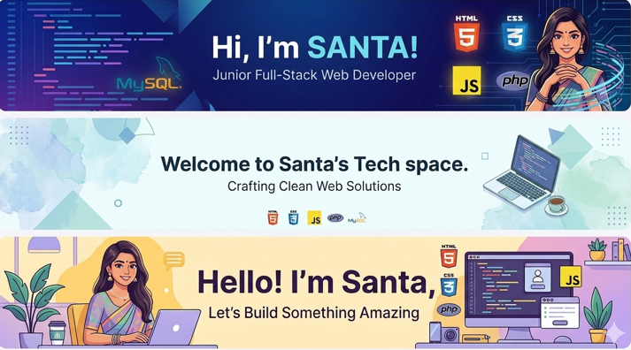

# Hi there! I'm Santa Akter👋
### 👩‍💻 About Me
- 🔭 I am a **Junior Full-Stack Web Developer** specialized in building modern web solutions.
- 🚀 Expert in **RESTful APIs**, **PHP**, and **JavaScript** environments.
- 🌱 Currently working with **React.js**, **Node.js**, and **WordPress**.
- 📫 Let's connect: [Email Me](mailto:rjmamun017@gmail.com)

### 🛠 Tech Stack

#### 🌐 Frontend Development

  
  
  
  
  

#### ⚙️ Backend & API

  
  
  

#### 🗄️ Database & CMS

  
  

### 🌐 Social Links

### 📊 GitHub Stats

  
  

---

  <b>Happy Coding! ✨</b>

